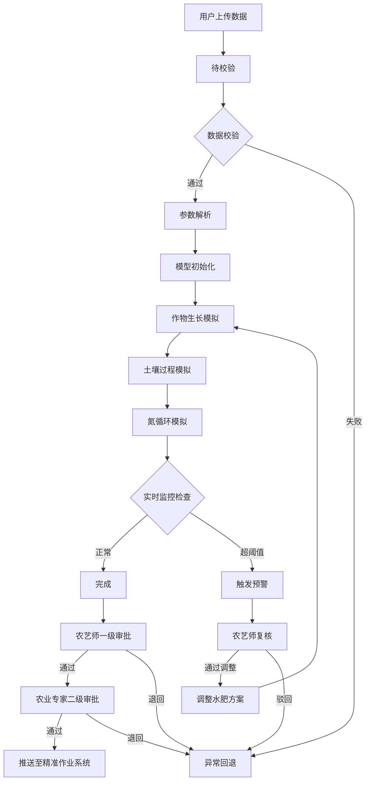
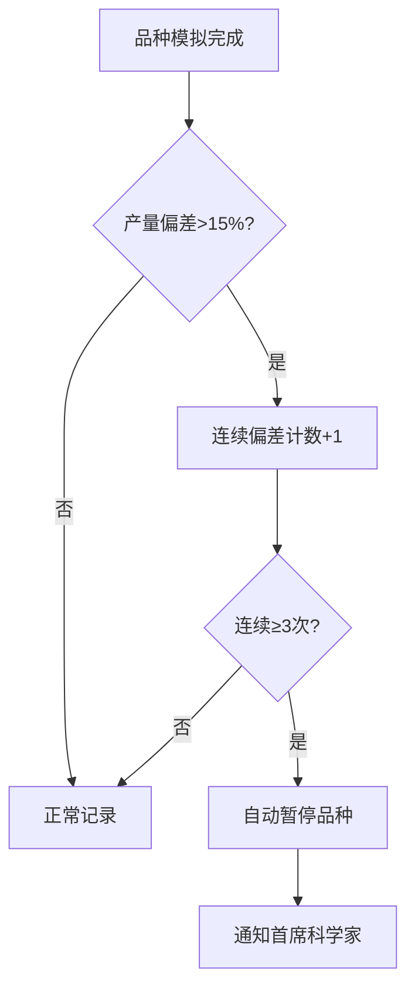

## 1. 产品概述

面向精准农业的高精度作物生长-土壤碳氮耦合模拟与智慧决策平台，旨在为农艺师和农业专家提供从数据输入到模拟决策的全链路数字化工具。系统通过耦合作物生长模型与土壤碳氮循环模型，实现水分亏缺与氮素淋失的智能预警、水肥方案自动优化、两级审批流转及综合报告生成，最大化水分利用效率与产量。

- 目标用户：农艺师（日常操作与初审）、农业专家（终审确认）、首席科学家（异常监控与品种暂停决策）
- 核心价值：将复杂农学模型转化为可操作的精准作业指令，降低水肥浪费、提升产量预测精度

## 2. 核心功能

### 2.1 用户角色

| 角色 | 注册方式 | 核心权限 |
|------|----------|----------|
| 农艺师 | 管理员分配账号 | 上传数据、启动模拟、复核预警、一级审批、查看报告 |
| 农业专家 | 管理员分配账号 | 二级审批确认田间可行性、查看报告与推荐策略 |
| 首席科学家 | 管理员分配账号 | 品种暂停/恢复决策、全局监控、系统配置 |
| 系统管理员 | 内置超管 | 用户管理、系统配置、日志审计 |

### 2.2 功能模块

1. **综合看板页**：每日统计看板、产量趋势图、管理指标雷达图、模拟完成率、水分/氮素利用效率
2. **模拟中心页**：数据上传、参数校验、任务状态流转、实时监控、预警推送
3. **预警与审批页**：多级预警列表、农艺师复核、调整日志、两级审批流程
4. **报告与导出页**：综合报告PDF生成、叶面积时序图、生物量分布图、产量等值线图、氮素平衡表、碳足迹估算、按品种/施肥/生育期分期导出
5. **智能推荐页**：历史模拟结果分析、最优水肥策略推荐、水分利用效率与产量优化方案
6. **系统管理页**：品种管理（含暂停状态）、用户管理、通知设置、调整日志

### 2.3 页面详情

| 页面名称 | 模块名称 | 功能描述 |
|----------|----------|----------|
| 综合看板 | 统计概览 | 展示今日/本周/本月模拟完成率、水分利用效率(WUE)、氮素利用效率(NUE) |
| 综合看板 | 产量趋势图 | 多品种产量预测趋势折线图，标注偏差超过15%的品种 |
| 综合看板 | 管理指标雷达图 | WUE、NUE、产量预测精度、预警响应率、审批通过率等多维雷达图 |
| 综合看板 | 品种预警状态 | 显示被暂停品种列表及暂停原因，连续三次偏差超15%自动标红 |
| 模拟中心 | 数据上传 | 上传田块土壤初始参数、作物基因型、历史气象序列及水肥管理方案 |
| 模拟中心 | 参数校验 | 自动校验数据物理范围，显示校验结果与异常项 |
| 模拟中心 | 任务列表 | 展示所有模拟任务，按状态筛选（待校验/参数解析/模型初始化/作物生长/土壤过程/氮循环/完成/异常回退） |
| 模拟中心 | 任务详情 | 展示任务状态流转时间线、当前阶段进度 |
| 模拟中心 | 实时监控 | 实时展示叶面积指数(LAI)、土壤含水量、矿质氮浓度曲线 |
| 模拟中心 | 预警触发 | 水分亏缺或氮素淋失超阈值时自动触发多级预警弹窗与推送 |
| 预警与审批 | 预警列表 | 按严重级别（一级/二级/三级）展示预警，支持筛选与排序 |
| 预警与审批 | 农艺师复核 | 查看预警详情，复核通过后自动调整灌溉量或施肥方案 |
| 预警与审批 | 调整日志 | 记录每次自动调整的灌溉量/施肥方案变更详情 |
| 预警与审批 | 一级审批 | 农艺师验证作物模型合理性，提交或退回 |
| 预警与审批 | 二级审批 | 农业专家确认田间可行性，通过后自动推送至精准作业指令系统 |
| 报告与导出 | 报告列表 | 展示已生成的模拟报告，支持预览与下载 |
| 报告与导出 | 报告详情 | 叶面积时序图、生物量空间分布图、产量等值线图、氮素平衡表、碳足迹估算 |
| 报告与导出 | PDF生成 | 一键生成综合报告PDF |
| 报告与导出 | 数据导出 | 按品种类型、施肥处理、生育期分期导出场生长与土壤数据 |
| 智能推荐 | 策略推荐 | 根据历史模拟结果自动推荐最优水肥策略 |
| 智能推荐 | 对比分析 | 不同水肥策略的WUE与产量对比图表 |
| 智能推荐 | 策略应用 | 一键应用推荐策略启动新模拟 |
| 系统管理 | 品种管理 | 品种列表、暂停/恢复品种、查看连续偏差记录 |
| 系统管理 | 用户管理 | 用户列表、角色分配、账号启用/禁用 |
| 系统管理 | 通知设置 | 预警推送阈值配置、通知渠道设置 |
| 系统管理 | 日志审计 | 调整日志、审批日志、系统操作日志 |

## 3. 核心流程

### 3.1 模拟任务全流程

用户上传数据后，系统自动校验数据物理范围。校验通过后，任务依次经历"待校验→参数解析→模型初始化→作物生长→土壤过程→氮循环→完成"状态流转。任一阶段出现异常则回退至"异常回退"状态。计算过程中实时监控LAI、土壤含水量与矿质氮浓度，当水分亏缺或氮素淋失超阈值时自动触发多级预警推送至农艺师复核，复核通过则自动调整灌溉量或施肥方案重新模拟并记录调整日志。

### 3.2 两级审批流程

模拟完成后需经两级审批：农艺师验证作物模型合理性（一级审批），通过后提交农业专家确认田间可行性（二级审批），通过后自动推送至精准作业指令生成系统。

### 3.3 品种暂停机制

同一品种连续三次模拟的产量预测偏差超过15%时，自动暂停该品种新任务并通知首席科学家。

## 4. 用户界面设计

### 4.1 设计风格

- **主色调**：深翠绿(#1B5E20)作为品牌色，象征农业生机；搭配暖土棕(#8D6E63)作为辅助色，呼应土壤主题
- **强调色**：琥珀黄(#FFA000)用于预警强调，天青蓝(#0288D1)用于数据可视化
- **按钮风格**：圆角8px，主按钮实心填充，次按钮描边，危险操作使用红色
- **字体**：标题使用 Noto Serif SC 衬线体营造专业感，正文使用 Noto Sans SC 无衬线体保证可读性
- **布局风格**：左侧固定导航栏，顶部状态栏，内容区域卡片式布局
- **图标风格**：线性图标(lucide)，2px描边，与整体专业风格统一

### 4.2 页面设计概览

| 页面名称 | 模块名称 | UI元素 |
|----------|----------|--------|
| 综合看板 | 统计概览 | 顶部4张统计卡片(模拟完成率/WUE/NUE/活跃预警)，深翠绿渐变背景，白色数字，入场动画 |
| 综合看板 | 产量趋势图 | 面积折线图，多品种对比，偏差超15%区域标红，工具提示悬浮详情 |
| 综合看板 | 管理指标雷达图 | 5维雷达图，当前值与目标值对比，中心渐变填充 |
| 综合看板 | 品种预警状态 | 列表卡片，暂停品种红色标签，正常品种绿色标签 |
| 模拟中心 | 数据上传 | 分步上传表单(4步)，拖拽上传区域，校验进度条，异常项红色标注 |
| 模拟中心 | 任务列表 | 表格布局，状态标签色块区分，支持筛选排序分页 |
| 模拟中心 | 实时监控 | 三栏实时曲线图(LAI/含水量/矿质氮)，阈值线虚线标注，超限区域红色填充 |
| 模拟中心 | 预警弹窗 | 居中弹窗，三级预警颜色区分(黄/橙/红)，操作按钮 |
| 预警与审批 | 预警列表 | 卡片列表，左侧色条标识严重级别，右侧操作按钮组 |
| 预警与审批 | 审批流程 | 步骤条展示审批状态，审批意见输入区，审批按钮组 |
| 报告与导出 | 报告详情 | 多标签页切换(叶面积/生物量/产量/氮素/碳足迹)，图表区域+数据表格 |
| 报告与导出 | 数据导出 | 三个筛选维度下拉框(品种/施肥/生育期)，导出按钮，历史导出记录 |
| 智能推荐 | 策略推荐 | 推荐策略卡片，WUE与产量指标突出展示，应用按钮 |
| 智能推荐 | 对比分析 | 分组柱状图，不同策略指标对比，最优策略高亮 |
| 系统管理 | 品种管理 | 表格布局，暂停状态切换开关，偏差历史弹窗 |

### 4.3 响应式设计

- 桌面优先设计，主要内容区域最小宽度1200px
- 侧边栏可折叠，窄屏时自动收起为图标模式
- 图表区域自适应宽度，保持最小可读尺寸
- 表格在窄屏下启用横向滚动

### 4.4 3D场景指引

- 不适用（本平台以数据可视化与业务流程为主，无需3D场景）
