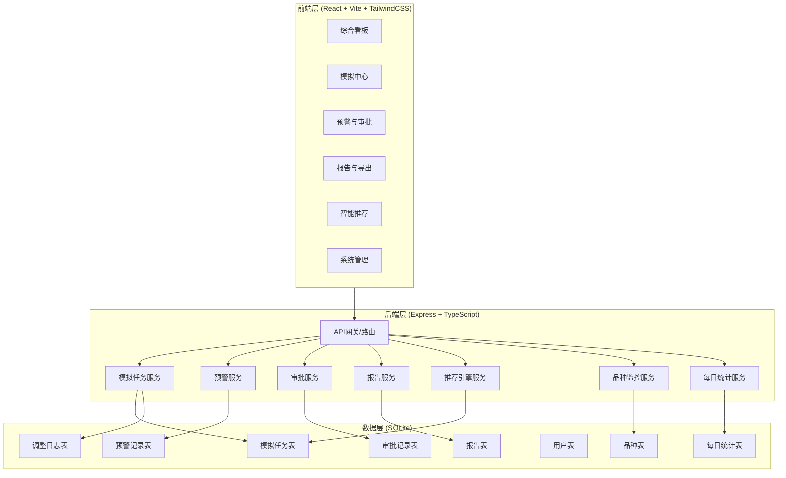
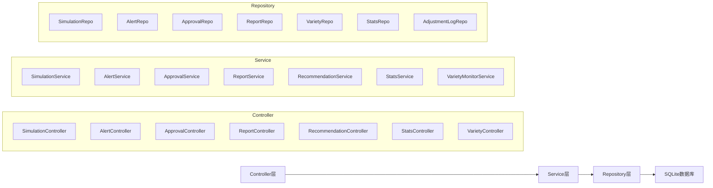
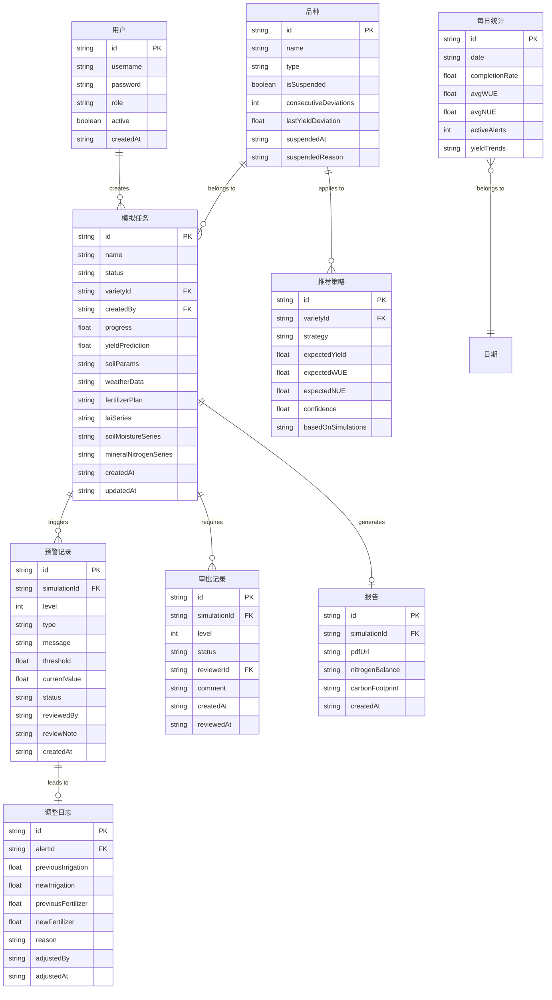

## 1. 架构设计



## 2. 技术说明

- **前端**：React@18 + TailwindCSS@3 + Vite + Zustand（状态管理）+ Recharts（图表库）
- **初始化工具**：vite-init
- **后端**：Express@4 + TypeScript（ESM格式）
- **数据库**：SQLite（better-sqlite3），适合单机部署场景
- **PDF生成**：后端使用 jsPDF 生成综合报告
- **图表渲染**：前端使用 Recharts 渲染所有数据可视化图表

## 3. 路由定义

| 路由 | 用途 |
|------|------|
| / | 综合看板页，展示每日统计、产量趋势、雷达图、品种预警状态 |
| /simulation | 模拟中心页，数据上传、任务管理、实时监控 |
| /simulation/:id | 模拟任务详情页，状态流转、实时曲线、预警信息 |
| /alerts | 预警与审批页，预警列表、复核操作、两级审批 |
| /reports | 报告与导出页，报告列表、PDF生成、数据导出 |
| /reports/:id | 报告详情页，叶面积/生物量/产量/氮素/碳足迹图表 |
| /recommendation | 智能推荐页，策略推荐、对比分析 |
| /admin | 系统管理页，品种/用户/通知/日志管理 |

## 4. API定义

### 4.1 模拟任务相关

```typescript
interface SimulationTask {
  id: string
  name: string
  status: "pending_validation" | "parsing" | "initializing" | "crop_growth" | "soil_process" | "nitrogen_cycle" | "completed" | "error_rollback"
  varietyId: string
  soilParams: SoilParams
  weatherData: WeatherRecord[]
  fertilizerPlan: FertilizerPlan
  currentStage: string
  progress: number
  laiSeries: DataPoint[]
  soilMoistureSeries: DataPoint[]
  mineralNitrogenSeries: DataPoint[]
  yieldPrediction: number | null
  createdAt: string
  updatedAt: string
}

interface SoilParams {
  organicMatter: number
  totalNitrogen: number
  phValue: number
  bulkDensity: number
  fieldCapacity: number
  wiltingPoint: number
  initialMoisture: number
  initialMineralN: number
}

interface WeatherRecord {
  date: string
  tempMax: number
  tempMin: number
  radiation: number
  precipitation: number
  windSpeed: number
  humidity: number
}

interface FertilizerPlan {
  applications: FertilizerApplication[]
}

interface FertilizerApplication {
  date: string
  type: string
  amount: number
  method: string
}

interface DataPoint {
  time: string
  value: number
}

// POST /api/simulations - 创建模拟任务
// GET /api/simulations - 获取模拟任务列表
// GET /api/simulations/:id - 获取模拟任务详情
// PUT /api/simulations/:id/status - 更新任务状态
// POST /api/simulations/:id/validate - 校验上传数据
```

### 4.2 预警相关

```typescript
interface Alert {
  id: string
  simulationId: string
  level: 1 | 2 | 3
  type: "water_deficit" | "nitrogen_leaching"
  message: string
  threshold: number
  currentValue: number
  status: "pending" | "reviewed" | "adjusted" | "dismissed"
  reviewedBy: string | null
  reviewNote: string | null
  adjustmentLog: AdjustmentLog | null
  createdAt: string
}

interface AdjustmentLog {
  id: string
  alertId: string
  previousIrrigation: number
  newIrrigation: number
  previousFertilizer: number
  newFertilizer: number
  reason: string
  adjustedBy: string
  adjustedAt: string
}

// GET /api/alerts - 获取预警列表
// PUT /api/alerts/:id/review - 农艺师复核预警
// GET /api/alerts/:id/adjustment - 获取调整日志
```

### 4.3 审批相关

```typescript
interface Approval {
  id: string
  simulationId: string
  level: 1 | 2
  status: "pending" | "approved" | "rejected"
  reviewerId: string | null
  reviewerName: string | null
  comment: string | null
  createdAt: string
  reviewedAt: string | null
}

// GET /api/approvals - 获取审批列表
// PUT /api/approvals/:id - 提交审批结果
```

### 4.4 报告相关

```typescript
interface Report {
  id: string
  simulationId: string
  varietyName: string
  laiChart: string
  biomassChart: string
  yieldContourChart: string
  nitrogenBalance: NitrogenBalance
  carbonFootprint: CarbonFootprint
  pdfUrl: string | null
  createdAt: string
}

interface NitrogenBalance {
  input: number
  uptake: number
  leaching: number
  volatilization: number
  residue: number
}

interface CarbonFootprint {
  totalEmission: number
  perUnitYield: number
  fertilizerEmission: number
  irrigationEmission: number
  soilEmission: number
}

// GET /api/reports - 获取报告列表
// GET /api/reports/:id - 获取报告详情
// POST /api/reports/:id/pdf - 生成PDF报告
// GET /api/reports/export - 按条件导出数据
```

### 4.5 推荐相关

```typescript
interface Recommendation {
  id: string
  varietyId: string
  varietyName: string
  strategy: FertilizerPlan
  expectedYield: number
  expectedWUE: number
  expectedNUE: number
  confidence: number
  basedOnSimulations: string[]
}

// GET /api/recommendations - 获取推荐策略列表
// POST /api/recommendations/:id/apply - 应用推荐策略启动新模拟
```

### 4.6 统计与看板相关

```typescript
interface DailyStats {
  date: string
  completionRate: number
  avgWUE: number
  avgNUE: number
  activeAlerts: number
  yieldTrends: YieldTrend[]
}

interface YieldTrend {
  varietyId: string
  varietyName: string
  data: DataPoint[]
  isSuspended: boolean
  consecutiveDeviations: number
}

// GET /api/stats/daily - 获取每日统计
// GET /api/stats/dashboard - 获取看板数据
```

### 4.7 品种相关

```typescript
interface Variety {
  id: string
  name: string
  type: string
  isSuspended: boolean
  consecutiveDeviations: number
  lastYieldDeviation: number | null
  suspendedAt: string | null
  suspendedReason: string | null
}

// GET /api/varieties - 获取品种列表
// PUT /api/varieties/:id/suspend - 暂停品种
// PUT /api/varieties/:id/resume - 恢复品种
```

## 5. 服务端架构图



## 6. 数据模型

### 6.1 数据模型定义



### 6.2 数据定义语言

```sql
CREATE TABLE users (
    id TEXT PRIMARY KEY,
    username TEXT NOT NULL UNIQUE,
    password TEXT NOT NULL,
    role TEXT NOT NULL CHECK(role IN ('agronomist', 'expert', 'chief_scientist', 'admin')),
    active INTEGER NOT NULL DEFAULT 1,
    created_at TEXT NOT NULL DEFAULT (datetime('now'))
);

CREATE TABLE varieties (
    id TEXT PRIMARY KEY,
    name TEXT NOT NULL,
    type TEXT NOT NULL,
    is_suspended INTEGER NOT NULL DEFAULT 0,
    consecutive_deviations INTEGER NOT NULL DEFAULT 0,
    last_yield_deviation REAL,
    suspended_at TEXT,
    suspended_reason TEXT
);

CREATE TABLE simulation_tasks (
    id TEXT PRIMARY KEY,
    name TEXT NOT NULL,
    status TEXT NOT NULL DEFAULT 'pending_validation' CHECK(status IN ('pending_validation','parsing','initializing','crop_growth','soil_process','nitrogen_cycle','completed','error_rollback')),
    variety_id TEXT NOT NULL REFERENCES varieties(id),
    created_by TEXT NOT NULL REFERENCES users(id),
    progress REAL NOT NULL DEFAULT 0,
    yield_prediction REAL,
    soil_params TEXT NOT NULL,
    weather_data TEXT NOT NULL,
    fertilizer_plan TEXT NOT NULL,
    lai_series TEXT,
    soil_moisture_series TEXT,
    mineral_nitrogen_series TEXT,
    created_at TEXT NOT NULL DEFAULT (datetime('now')),
    updated_at TEXT NOT NULL DEFAULT (datetime('now'))
);

CREATE TABLE alerts (
    id TEXT PRIMARY KEY,
    simulation_id TEXT NOT NULL REFERENCES simulation_tasks(id),
    level INTEGER NOT NULL CHECK(level IN (1,2,3)),
    type TEXT NOT NULL CHECK(type IN ('water_deficit','nitrogen_leaching')),
    message TEXT NOT NULL,
    threshold REAL NOT NULL,
    current_value REAL NOT NULL,
    status TEXT NOT NULL DEFAULT 'pending' CHECK(status IN ('pending','reviewed','adjusted','dismissed')),
    reviewed_by TEXT REFERENCES users(id),
    review_note TEXT,
    created_at TEXT NOT NULL DEFAULT (datetime('now'))
);

CREATE TABLE adjustment_logs (
    id TEXT PRIMARY KEY,
    alert_id TEXT NOT NULL REFERENCES alerts(id),
    previous_irrigation REAL NOT NULL,
    new_irrigation REAL NOT NULL,
    previous_fertilizer REAL NOT NULL,
    new_fertilizer REAL NOT NULL,
    reason TEXT NOT NULL,
    adjusted_by TEXT NOT NULL REFERENCES users(id),
    adjusted_at TEXT NOT NULL DEFAULT (datetime('now'))
);

CREATE TABLE approvals (
    id TEXT PRIMARY KEY,
    simulation_id TEXT NOT NULL REFERENCES simulation_tasks(id),
    level INTEGER NOT NULL CHECK(level IN (1,2)),
    status TEXT NOT NULL DEFAULT 'pending' CHECK(status IN ('pending','approved','rejected')),
    reviewer_id TEXT REFERENCES users(id),
    comment TEXT,
    created_at TEXT NOT NULL DEFAULT (datetime('now')),
    reviewed_at TEXT
);

CREATE TABLE reports (
    id TEXT PRIMARY KEY,
    simulation_id TEXT NOT NULL UNIQUE REFERENCES simulation_tasks(id),
    pdf_url TEXT,
    nitrogen_balance TEXT,
    carbon_footprint TEXT,
    created_at TEXT NOT NULL DEFAULT (datetime('now'))
);

CREATE TABLE recommendations (
    id TEXT PRIMARY KEY,
    variety_id TEXT NOT NULL REFERENCES varieties(id),
    strategy TEXT NOT NULL,
    expected_yield REAL NOT NULL,
    expected_wue REAL NOT NULL,
    expected_nue REAL NOT NULL,
    confidence REAL NOT NULL,
    based_on_simulations TEXT NOT NULL
);

CREATE TABLE daily_stats (
    id TEXT PRIMARY KEY,
    date TEXT NOT NULL UNIQUE,
    completion_rate REAL NOT NULL DEFAULT 0,
    avg_wue REAL NOT NULL DEFAULT 0,
    avg_nue REAL NOT NULL DEFAULT 0,
    active_alerts INTEGER NOT NULL DEFAULT 0,
    yield_trends TEXT
);

CREATE INDEX idx_simulation_tasks_status ON simulation_tasks(status);
CREATE INDEX idx_simulation_tasks_variety ON simulation_tasks(variety_id);
CREATE INDEX idx_alerts_simulation ON alerts(simulation_id);
CREATE INDEX idx_alerts_status ON alerts(status);
CREATE INDEX idx_approvals_simulation ON approvals(simulation_id);
CREATE INDEX idx_approvals_status ON approvals(status);
CREATE INDEX idx_daily_stats_date ON daily_stats(date);
```
